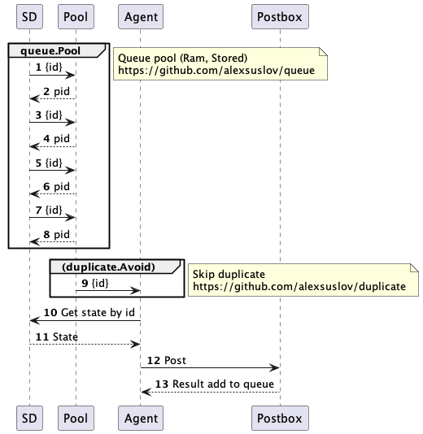

# Example



```go

Pool := &queue.Pool{}
Avoid := &duplicate.Avoid{}

go loop(Pool, Avoid)

func loop(p *queue.Pool, d *duplicate.Avoid) {
  for {
    key, ok := p.Pop().(string)
    if ok {
      ctx, fn := context.WithCancel(context.Background())
      d.Push(key, fn)
      go func() {
        err := Post(ctx, key)
        // retry
        if err!=nil{
          p.Push(key)
          return
        }
        if ctx.Err() == nil {
          d.Remove(key)
        }
      }()
    }
  }
}


func(w http.ResponseWriter, r *http.Request) {
  key := r.URL.Query().Get("key")
  Pool.Push(key)
  w.Write([]byte("done"))
}


```
