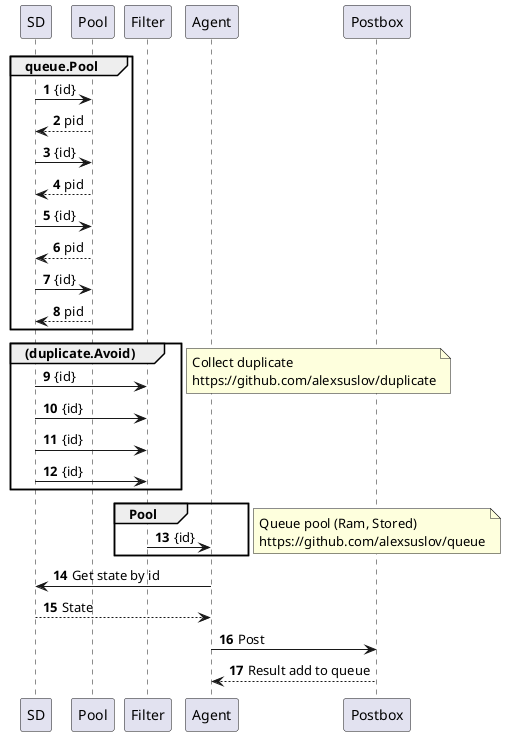

# Income



```go
const service="SERVICE"

Pool := &queue.Pool{}
Avoid := &duplicate.Avoid{}

go func(p *queue.Pool, d duplicate.Avoid) {
  for{
    if key, ok := Pool.Pop().(string); ok {
      ctx, fn := context.WithCancel(context.Background())
      d.Push(key,fn)
      if err:=Post(ctx, key); err!=nil{
        if err1:=ErrorTicket(key, err); err1!=nil{
          Notify(service, key, err, err1)
        }
      }
      d.Remove(req.ID)
    }
  }
}(Pool, Avoid)

func(w http.ResponseWriter, r *http.Request) {
  key := r.URL.Query().Get("key")
  Pool.Push(key)
  w.Write([]byte("done"))
}


```
